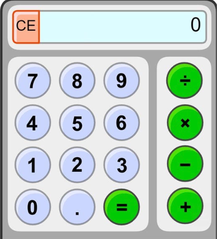

# calc-web-next
Calculator web app on Next.js

## Requirements
Build a simple calculator web application based on the attached UI mockup.



### Tech stack
- Next.js
- TypeScript
- Tailwind CSS

### Scope
- Support basic arithmetic operations (add, subtract, multiply, divide)
- Input via on-screen buttons
- Clear/reset functionality
- Sensible handling of edge cases

The goal is to assess code structure, state management, and overall implementation quality. Exact (or close enough) UI pixel matching is required.

### Deliverables
- Git repository with the solution
- Short README with setup instructions and any assumptions made


# Implementation Notes
- The size of the calculator is fixed to match the mockup (225x400px) - 
  how it looks in the _email_ (the raw image is 450x800px).
- Button labels are rendered as text to allow internationalization, 
  accessibility, better scaling on high-DPI screens, and adding more
  operations easily.
- All the graphics are done with pure CSS, no image assets are used.
- Favicon is from Google's Material Symbols (Calculate), Apache License v 2.0.

## Running locally 

Run the development server:
```bash
npm run dev
```

Open http://localhost:3000 with your browser to use the calculator.

## Tasks done

## Backlog
- Backbone UI with clickable buttons and rendering the current calculator state
- Calculator logic implementation with unit tests
- Style the app to match the mockup
- Add a favicon

## Future improvements
- Build SPA app with GitHub actions and publish to GitHub pages
- Buttons with armed state and hover effects
- Keyboard support
- Memory functions (M+, M-, MR, MC)
- Theme support (light/dark mode)
- Internationalization (i18n) support for multiple languages
- Right to left layout support for languages like Arabic, Hebrew, etc.
- Accessibility improvements (ARIA labels, screen reader support)
- Scientific calculator mode with advanced functions (sin, cos, tan, log, etc.)
